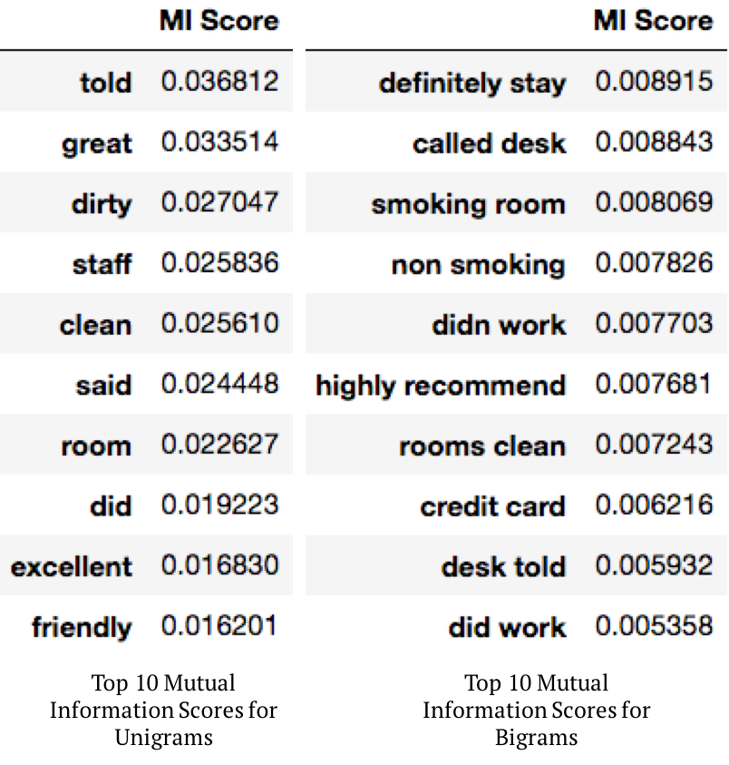

# Sentiment-Analysis-for-Hotel-Reviews
## Overview
This project is analyzing sentiment in hotel reviews using **Mutual Information** and **Vader Sentiment Analyzer**. We crawl hotel review data from Trip Advisor website by using a python script which can be downloaded at [here](https://github.com/aesuli/trip-advisor-crawler).

We use **Vader sentiment analyzer, Mutual Information and Point-wise Mutual Information** to discover the relation between those metrics and ground-truth rating scores.

## Pipeline

1. Crawl hotel review data from Trip Advisor by using a python script ([click](https://github.com/aesuli/trip-advisor-crawler) to see how to use the script)

2. Read the data (.csv format) into **pandas dataframe**

3. Use **Vader sentiment analyzer**

4. Build a **bag-of-words model** (unigram)

5. Calculate **word frequency**, **mutual information** and **pointwise mutual information** for the unigrams to see how they relate with the review scores

6. **Visualize** the distribution of the ground-truth scores and Vader scores
7. Discuss

## Which words were most sentiment-bearing in the reviews?
* To explore this question, we will calculate the following 3 factors.
### 1. Word Frequency

* It seems like the word frequency doesn't tell us anything about the context. There is no difference between the top-k word list for both positive reviews and negative reviews.

* If we think about it, this result seems obvious. If a customer was really satistied with breakfast, they would mention the word, 'breakfast', in their review. Even if a customer didn't like their breakfast, they also would mention the word, 'breakfast', in their review (with some bad words).

### 2. Mutual Information
* *Mutual information* tells you how much you learn about X from knowing the value of Y (on average over the choice of Y).

Since we found the word frequency is not a good indicator for the sentiment analysis, we will examine mutual information for an alternative metric.

### 3. Pointwise Mutual Information (PMI)
* Let's see how Pointwise Mutual Information calculated. The PMI of a pair of outcomes x and y belonging to discrete random variables X and Y quantifies the discrepancy between the probability of their coincidence given their joint distribution and their individual distributions, assuming independence.
* To study more about Pointwise Mutual Information, see [Wikipedia](https://en.wikipedia.org/wiki/Pointwise_mutual_information)

#### Pointwise Mutual Information seems like a good metric to summarize the reviews in n-gram tokens!
#### By reading the n-gram tokens with high PMI scores for target variable, we can get a sense how much the reviewer did or didn't like the hotels. 

## Visualization
Sometimes, we can learn a lot about the data by visualizing.

